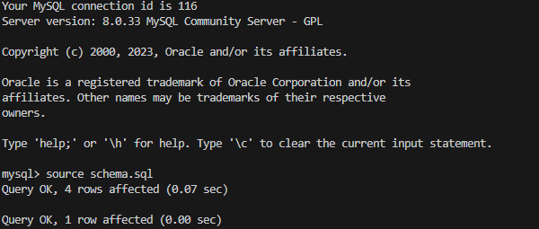
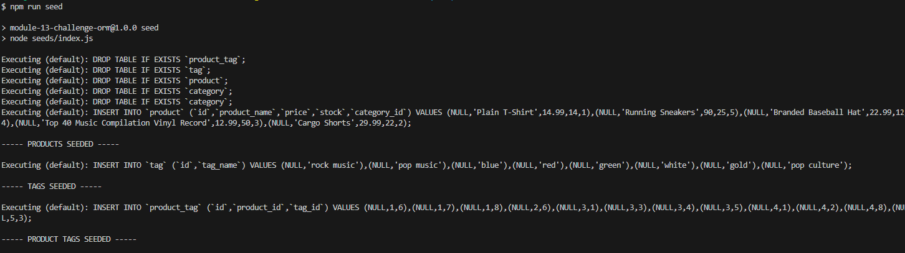
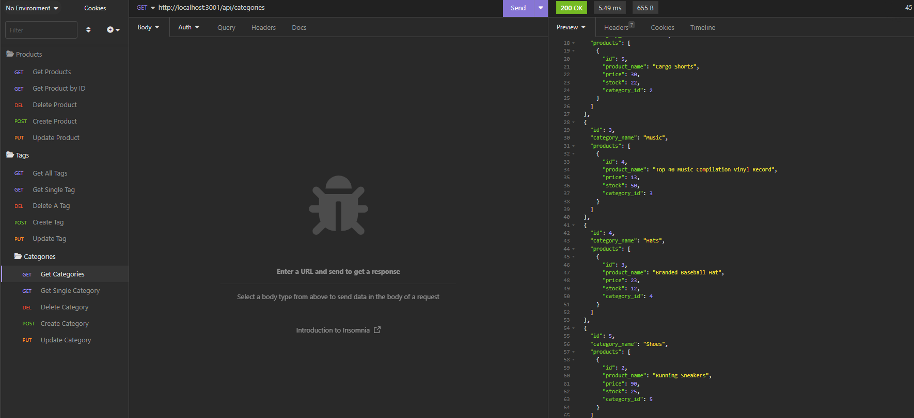

# ORM-E-Commerce-Back-End

## Description
Internet retail, also known as e-commerce, is the largest sector of the electronicd=s industry. For this challenge, we are required to build the back end of an e-commerce site using express.js and configure using Sequelize to interact with a MySQL database.

## Installtion
1. Open the terminal window and install your NPM package and required dependencies by typing npm i
2. Once you have the dependencies installed connect your mysql2 to connect to your database and perform queries by typing mysql - u root -p. This will intialise MySQL.
3. Run 'npm run seed' in the terminal
4. Once you have run those commands run the server.js command to invoke the functionality.

## User Story

```md
AS A manager at an internet retail company
I WANT a back end for my e-commerce website that uses the latest technologies
SO THAT my company can compete with other e-commerce companies
```


## Acceptance Criteria

```md
GIVEN a functional Express.js API
WHEN I add my database name, MySQL username, and MySQL password to an environment variable file
THEN I am able to connect to a database using Sequelize
WHEN I enter schema and seed commands
THEN a development database is created and is seeded with test data
WHEN I enter the command to invoke the application
THEN my server is started and the Sequelize models are synced to the MySQL database
WHEN I open API GET routes in Insomnia for categories, products, or tags
THEN the data for each of these routes is displayed in a formatted JSON
WHEN I test API POST, PUT, and DELETE routes in Insomnia
THEN I am able to successfully create, update, and delete data in my database
```


## Walkthrough of application
### MySQL


### Seeds


### App Listening


### Insomnia



## Link to Github Repository
https://github.com/Saria995/ORM-E-Commerce-Back-End.git
